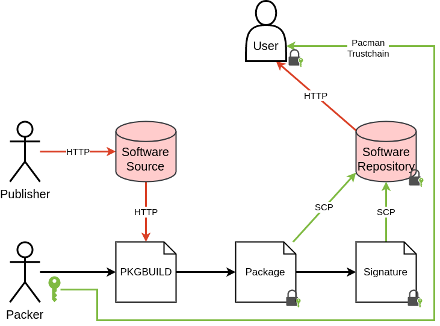
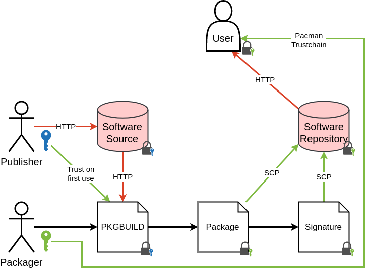
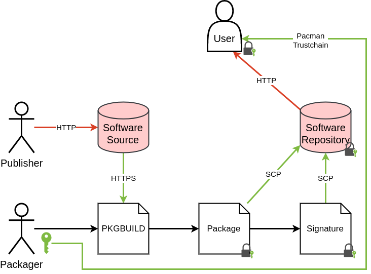
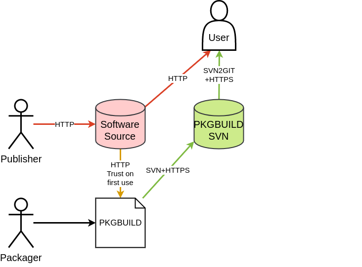
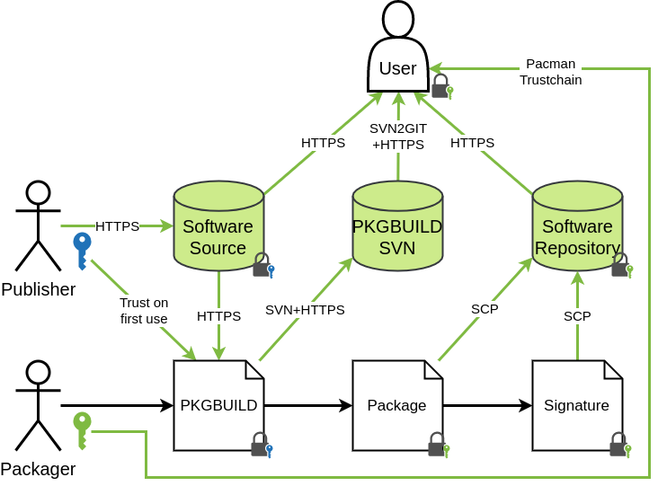

# Arch Linux

## Table of Content
- TOC
{:toc}

## Results

### General Criteria

| Rating    | Security            | Explanation                             |
|-----------|---------------------|-----------------------------------------|
| Excellent | Very secure         | Criteria is met optimal                 |
| High      | Secure              | Criteria is met                         |
| Mid       | Insufficient secure | Criteria is met partly                  |
| Low       | Insecure            | Criteria is no met                      |
| N/A       | Not rated           | Criteria is not available or irrelevant |

### Package

| Rating    | Explanation                  |
|-----------|------------------------------|
| Excellent | All criteria >= high         |
| High      | GPG key + signatures >= high |
| Mid       | HTTPS >= high                |
| Low       | Rest                         |
| N/A       | No sources used              |

 

 


### GPG Key

| Rating    | Explanation                                     |
|-----------|-------------------------------------------------|
| Excellent | Only strong GPG keys used >= RSA4096 / ECC      |
| High      | Only secure GPG keys used >= RSA 2048           |
| Mid       | Insecure keys used < RSA 2048 or DSA or expired |
| Low       | No GPG keys used                                |
| N/A       | Only local/no sources used                      |

 

 

 


### GPG Signature

| Rating    | Explanation                                     |
|-----------|-------------------------------------------------|
| Excellent | Same as high + GPG Key excellent                |
| High      | All sources are signed (excluding local files)  |
| Mid       | Some sources are signed (excluding local files) |
| Low       | No sources are signed                           |
| N/A       | Only local/no sources used                      |

 

 


### HTTPS

| Rating    | Explanation                                    |
|-----------|------------------------------------------------|
| Excellent | Same as high + upstream URL HTTPS              |
| High      | All sources use HTTPS (excluding local files)  |
| Mid       | Some sources use HTTPS (excluding local files) |
| Low       | No sources use HTTPS                           |
| N/A       | Only local/no sources used                     |

 

 


### Hash

| Rating    | Explanation              |
|-----------|--------------------------|
| Excellent | SHA512/Whirlpool         |
| High      | SHA256/SHA384            |
| Mid       | SHA1                     |
| Low       | MD5/SKIP in archives     |
| N/A       | Only VCS/no sources used |

 

 


## Threat Models

### Initial Thread Model
The following assumptions were made in the worst case scenario:

#### Assumptions
* GnuPG works correct and is secure
* Secure and secret GPG keys were used and exchanged correct
* Packages are secured through GPG signatures
* Software sources and packages are exchanged over an insecure connection
* Downloadservers are vulnerable

#### Threats
* The source code gets modified while uploading
* The source code gets modified while downloading
* The source code gets modified on the download server

#### Secured Threats
* Package gets modified while up/downloading (GPG)
* Package gets modified on the download server (GPG)

#### Unconsidered Threats
* The software contains a security vulnerability
* The Publisher, Packager or the Pacman Trustchain gets attacked
* The Pacman Database gets modified (Replay/Downgrade attack)

### GPG
Changes to the initial thread model:

#### Assumptions
* Software sources are secured through GPG signatures

#### Threats
* None

#### Secured Threats
* The source code gets modified while uploading (GPG)
* The source code gets modified while downloading (GPG)
* The source code gets modified on the download server (GPG)
* Package gets modified while up/downloading (GPG)
* Package gets modified on the download server (GPG)

### HTTPS
Changes to the initial thread model:

#### Assumptions
* Software sources are exchanged over a secure HTTPS connection

#### Threats
* The source code gets modified while uploading
* The source code gets modified on the download server

#### Secured Threats
* The source code gets modified while downloading (HTTPS)
* Package gets modified while up/downloading (GPG)
* Package gets modified on the download server (GPG)

### Hash
Changes to the initial thread model:

#### Assumptions
* The user wants to build a package on his own with the official PKGBUILD
* The PKGBUILD is downloaded over a secure channel and verified manually afterwards
* Secure hash algorithms are used

#### Threats
* The source code gets modified while uploading
* The source code gets modified while downloading from the packager
* The source code gets modified on the download server

#### Secured Threats
* The source code gets modified while downloading from the user (hash verification)

#### Irrelevant Threats:
* Package gets modified while up/downloading (Rebuild)
* Package gets modified on the download server (Rebuild)

### Best Case Scenario
Changes to the initial thread model:

#### Assumptions
* GnuPG works correct and is secure
* Secure and secret GPG keys were used and exchanged correct
* Packages are secured through GPG signatures
* Software sources are secured through GPG signatures
* Software sources are exchanged over a secure HTTPS connection
* Secure hash algorithms are used
* Downloadservers are secured against attacks and use latest security updates

#### Secured Threats
* The source code gets modified while uploading (GPG, HTTPS)
* The source code gets modified while downloading (GPG, HTTPS)
* The source code gets modified on the download server (GPG, secure server)
* Package gets modified while up/downloading (GPG, HTTPS)
* Package gets modified on the download server (GPG, secure server)

